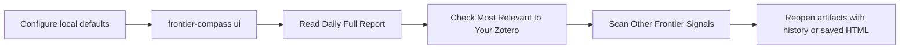

<div align="center">
  <h1>FrontierCompass</h1>
  <p><strong>A local-first research scouting desk for daily biomedical reading.</strong></p>
  <p><strong>一个面向生物医学文献筛读的本地优先研究工作台。</strong></p>
</div>

<p align="center">
  
  
  
  
</p>

<p align="center">
  <a href="#why-frontiercompass">Why FrontierCompass</a> ·
  <a href="#3-minute-quickstart">3-Minute Quickstart</a> ·
  <a href="#choose-your-surface">Choose Your Surface</a> ·
  <a href="#typical-daily-workflow">Daily Workflow</a> ·
  <a href="#personalization-with-zotero">Zotero</a> ·
  <a href="#docs">Docs</a>
</p>

FrontierCompass helps you review what is new in biomedical research without leaving your own machine. It materializes a local daily run, keeps cache and HTML artifacts under predictable folders, and lets you read the result from a Streamlit homepage, a CLI workflow, or a small Python API.

FrontierCompass 让你在本地完成“抓取新论文 -> 生成日报 -> 个性化排序 -> 回看历史”的整套流程。它不是托管服务，不依赖后台任务，也不把运行产物散落到仓库根目录。

> [!TIP]
> The intended first experience is simple: configure Zotero once, run `frontier-compass ui`, read the three lanes, and reopen artifacts only when you need to inspect provenance.

> [!TIP]
> Configure Zotero once in `configs/user_defaults.json`, then let the `Digest` and `Frontier Report` carry the day-to-day workflow.

> [!NOTE]
> Local defaults in `configs/user_defaults.json` and runtime artifacts under `data/` are kept out of normal Git commits. FrontierCompass is designed to be shareable as code, not to leak your local reading state.

## Why FrontierCompass

<table>
  <tr>
    <td width="33%">
      <strong>Read First</strong><br><br>
      Open one page, scan the field-wide report, then move into your Zotero-aware lane and the peripheral signals.<br><br>
      <strong>阅读优先：</strong>先看领域全貌，再看个性化推荐，而不是先陷进参数配置。
    </td>
    <td width="33%">
      <strong>Stay Local</strong><br><br>
      Cache, report, and provenance artifacts live under predictable folders instead of disappearing into a hosted backend.<br><br>
      <strong>本地优先：</strong>产物可复现、可回看、可调试。
    </td>
    <td width="33%">
      <strong>Personalize Lightly</strong><br><br>
      Bring your Zotero library if you have it. Skip it if you do not. The baseline path still works.<br><br>
      <strong>轻量个性化：</strong>有 Zotero 更好，没有也能直接开始。
    </td>
  </tr>
</table>

## Experience Snapshot

| You want to... | Use this | Why it is the default |
| --- | --- | --- |
| Read today’s frontier quickly | `frontier-compass ui` | Best visual flow for the three report lanes |
| Materialize a dated artifact | `frontier-compass run-daily --today 2026-04-07` | Reproducible HTML + JSON output |
| Reopen the last few runs | `frontier-compass history --limit 5` | Fast provenance and artifact lookup |
| Script the workflow | `from frontier_compass import run_daily` | Small stable public API |

The primary supported surfaces are the `Python API`, the `local CLI`, and the `local interactive UI`.

## 3-Minute Quickstart

### 1. Install

FrontierCompass requires Python `>=3.10`.

```bash
git clone <your-repo-url>
cd FrontierCompass
pip install -e .
```

> [!IMPORTANT]
> FrontierCompass requires Python `>=3.10`.

### 2. Create your local defaults

```bash
cp configs/user_defaults.example.json configs/user_defaults.json
```

Edit `configs/user_defaults.json` and set at least one of:

- `default_zotero_db_path`
- `default_zotero_export_path`

If you do not have Zotero handy yet, you can still start without it. FrontierCompass will use the baseline profile.

如果你暂时还没有准备好 Zotero，也可以先跳过这一步，工具会自动退回到 baseline 模式。

### 3. Open the local UI

```bash
frontier-compass ui
```

If the installed entrypoint is unavailable in your shell, this does the same thing:

```bash
PYTHONPATH=src python -m frontier_compass.cli.main ui
```

### 4. Optional: materialize a dated run from the CLI

```bash
frontier-compass run-daily --today 2026-04-07
frontier-compass history --limit 5
```

For older examples and compatibility references, `frontier-compass run-daily --today 2026-03-24` remains a valid dated example.

That is the default supported path:

1. install
2. configure local defaults
3. open `ui`
4. optionally use `run-daily` and `history` for reproducible runs

## Choose Your Surface

| Surface | Best for | Shortest path |
| --- | --- | --- |
| Streamlit UI | Daily reading, browsing the three report lanes, inspecting local provenance visually | `frontier-compass ui` |
| CLI | Reproducible dated runs, automation, artifact generation, history inspection | `frontier-compass run-daily --today 2026-04-07` |
| Python API | Notebooks, local scripting, wrapping FrontierCompass into another workflow | `from frontier_compass import run_daily` |

The supported public Python surface is:

- `run_daily`
- `prepare_ui_session`
- `load_recent_history`
- `FrontierCompassRunner`
- `DailyRunResult`
- `LocalUISession`

```python
from datetime import date

from frontier_compass import run_daily

result = run_daily(requested_date=date(2026, 4, 7), max_results=80)

print(result.fetch_status_label)
print(result.cache_path)
print(result.report_path)
```

## Typical Daily Workflow



The default homepage is built around three reading lanes:

1. `Daily Full Report`
2. `Most Relevant to Your Zotero`
3. `Other Frontier Signals`

UI 首屏的重点就是这三块阅读内容，而不是把所有兼容参数直接抛给新用户。

> [!TIP]
> If you only try one thing on day one, try reading the lanes in this order: `Daily Full Report` -> `Most Relevant to Your Zotero` -> `Other Frontier Signals`.

## Personalization With Zotero

FrontierCompass supports three profile bases:

| Profile source | What it means |
| --- | --- |
| `baseline` | Deterministic default profile, no Zotero augmentation |
| `zotero_export` | Built from a reusable local `CSL JSON` export snapshot |
| `live_zotero_db` | Built directly from a readable local Zotero SQLite database |

Default resolution order:

1. readable `default_zotero_db_path`
2. readable `default_zotero_export_path` or reusable snapshot
3. fallback to `baseline`

Recommended path:

- put your Zotero DB or export path into `configs/user_defaults.json`
- start `frontier-compass ui`
- let the app auto-resolve personalization

Advanced overrides remain available:

```bash
frontier-compass run-daily --today 2026-04-07 --profile-source baseline
frontier-compass run-daily --today 2026-04-07 --profile-source zotero_export --zotero-export path/to/zotero-export.csl.json
frontier-compass run-daily --today 2026-04-07 --profile-source live_zotero_db --zotero-db-path /path/to/zotero.sqlite
frontier-compass run-daily --today 2026-04-07 --profile-source live_zotero_db --zotero-collection "Tumor microenvironment"
```

## Runtime Outputs

FrontierCompass keeps runtime artifacts under stable local folders:

| Path | What goes there |
| --- | --- |
| `configs/` | checked-in config examples and local user defaults |
| `data/raw/` | source payloads, Zotero snapshots, and source snapshots |
| `data/cache/` | JSON cache artifacts for daily runs |
| `data/db/` | local database files when persistence is added |
| `reports/daily/` | saved HTML daily reports |
| `reports/weekly/` | weekly rollups when added |

Runtime outputs should not be written to the repository root.

## Supported Default Path

The default public workflow is intentionally narrow:

- source bundle: `biomedical`
- default source composition: `arXiv + bioRxiv`
- primary commands: `ui`, `run-daily`, `history`
- default report mode: `deterministic`
- default cost mode: `zero-token`

This keeps v0.1 legible. Compatibility commands such as `daily`, `deliver-daily`, `demo-report`, and `demo-ranking` still exist, but they are not the main onboarding path.

In CLI and UI wording, this is the default public bundle (arXiv + bioRxiv).

The current scope is intentionally narrow: FrontierCompass focuses on titles, abstracts, metadata, and optional Zotero-derived signals. There is no full-text reading in the current build.

<details>
<summary><strong>Advanced Paths</strong></summary>

You only need these if the default path is not enough:

- `--mode ai-for-medicine` for an advanced bundle override
- `--mode biomedical-multisource` for compatibility-only 3-source runs including `medRxiv`
- `--start-date` and `--end-date` for range runs
- `--report-mode enhanced` when you explicitly configure an OpenAI-compatible endpoint

Example:

```bash
frontier-compass run-daily --mode biomedical --start-date 2026-04-01 --end-date 2026-04-07 --fetch-scope range-full
frontier-compass ui --print-command --today 2026-04-07
```

</details>

## Docs

- [Getting Started Tutorial](docs/tutorial.md)
- [Provenance and Runtime Notes](docs/provenance.md)
- [Live Validation Guide](docs/live_validation.md)

## Git Hygiene

The following local-only paths are intentionally excluded from normal commits:

- `configs/user_defaults.json`
- `data/raw/*`
- `data/cache/*`
- `data/db/*`
- `reports/daily/*`
- `reports/weekly/*`

That lets you publish the project without publishing your private defaults or local runtime artifacts.

## FAQ

### Do I need Zotero before I can use FrontierCompass?

No. Zotero improves personalization, but the baseline profile works out of the box.

### Where do reports go?

Saved HTML reports go to `reports/daily/`. JSON cache artifacts go to `data/cache/`.

### Does this run as a hosted service?

No. FrontierCompass is a local workflow. The optional `enhanced` report mode only becomes model-assisted when you explicitly configure an OpenAI-compatible endpoint.

### What command should most users start with?

`frontier-compass ui`

It is the shortest path to the intended reading experience.
